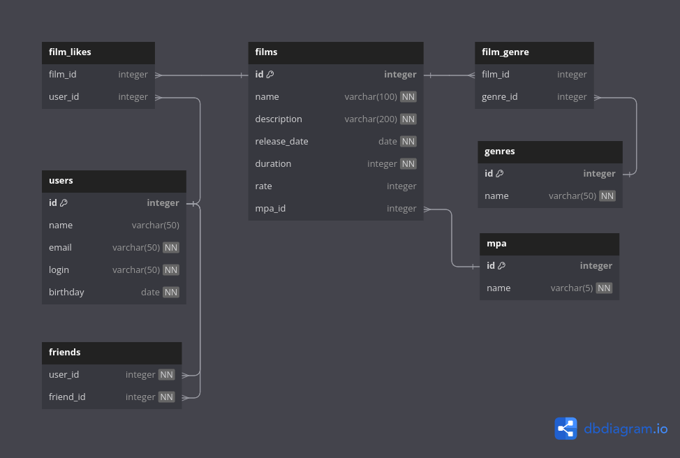

# java-filmorate
Template repository for Filmorate project.

## Database diagram

## API Filmorate
### Features:

### Films

- Create a film
- Update a film
- Get a film by ID
- Like a film
- Unlike a film
- Get popular films
- Delete a film

### Users

- Add a user
- Update a user
- Get all users
- Get a user by ID
- Add a user as a friend
- Remove a user from friends
- Get user's friends
- Get common friends with a user
- Delete a user

### Genres

- Get all genres
- Get a genre by ID

### Rating

- Get an age rating by ID
- Get all age ratings

## Testing

In the `tests` package.


## Examples
Get user friends
```postgres-psql
SELECT * FROM USERS 
WHERE ID IN (SELECT FRIEND_ID FROM FRIENDS WHERE USER_ID = ?)
 ```

Get genres by film id
```postgres-psql
SELECT * FROM GENRES 
WHERE GENRE_ID IN 
(SELECT GENRE_ID FROM FILM_GENRE WHERE FILM_ID = ?)
 ```

Get films of concrete genre
```postgres-psql
SELECT * FROM FILMS f
JOIN FILM_GENRE fg ON f.ID = fg.FILM_ID
WHERE fg.GENRE_ID = ?
 ```
